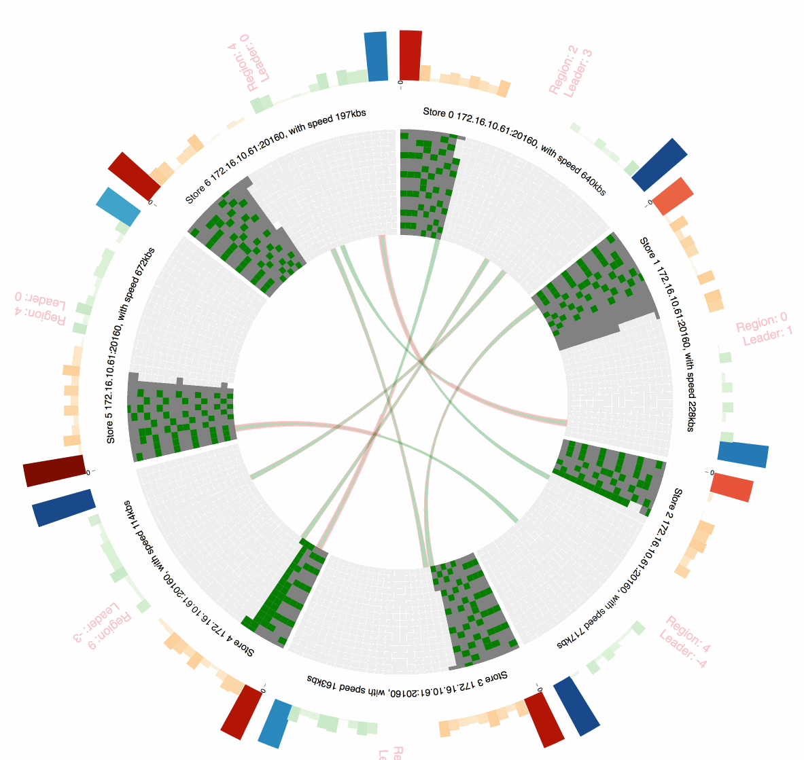

## PD vis

### Todo

- [] English version readme
- [] doc for REGION_BYTE_SIZE setting

### Dev

Prerequisite：

- 依赖于新版本的 PD Server [具体 PR](https://github.com/pingcap/pd/pull/881)

安装依赖：

- node v7+, npm
- npm install

> Tip: 如果需要外部访问，可修改 webpack.config.js 中 devServer 中的  host 配置

启动：

- 使用默认的 mock server: `export PD_ENDPOINT=localhost:9000;npm start`
- 使用外部 PD Server: `export PD_ENDPOINT=<PD_SERVER_IP>:<PORT>;npm start`

该组件通过独立（standalone）的 UI framework 提供对 PD 调度的可视化，通过 d3 （data-driven-document）作为底层render库，扩展改造的 circos 作为基本的 layout engine 实现 stacks，circle sector, chords等布局，通过 d3 transition 提供state间的过度效果等。

通过 dashboard 界面的入口，点击进入即可查看当前的集群 TiKV 数据分布（regions，leader），TiKV store和region的热度（i/o读写速率），PD schedule 调度的历史（region/leader transfer 信息。

其中：

- 圆环外围文字提供每次时间窗口内的该 store 的leader/region 变动情况，如 `+10 Regions, - 3 Leaders` 等
- 圆环外围的histogram 直方图，圆环方向左侧启示显示的store 写操作和热点 region 的写操作 flowtypes 信息，圆环方向右侧启示显示的store 读操作和热点 region 的读操作 flowtypes 信息
- 圆环的长度代表该圆环代表的store全部存储空间，文字信息是该store的主机 ip:port 和 id等基本信息
- 圆环内部的方块堆栈是按照“磁盘存储”显示三类信息：未使用空间块（浅灰色），普通region块（深灰色）和作为leader的块（绿色）
- 圆环内部的 chord 圆弧显示的store间的数据迁移（region）和leader transfer信息

在使用的时候，需要注意的是，根据集群当前所在的状态，如几个 tikv 实例节点，tikv 的存储使用情况，tikv 读写“热度”等情况会有不同的状态。
